# Employee Tracker

## Introduction:

Employee Tracker application powered by Node js with clean code. With this command line application You can quickly and easily manage company's database.

## Developer Insights:

I am thankful to my instructors at RutgersCodingBootcamp, that they teach me so well and I have crated this coding application.

## Bonus Work
- Update employee managers.
- View employees by manager.
- View employees by department.
- Delete departments, roles, and employees.
- View the total utilized budget of a department –in other words, the combined salaries of all employees in that department.

## Resources
-   [W3SCHOOLS.COM](https://www.w3schools.com/nodejs/)
-   [NODEJS](https://www.w3schools.com/nodejs/)
-   [MYSQL](https://www.npmjs.com/package/mysql2)
-   [Inquirer Package](https://www.npmjs.com/package/inquirer)

## How to run:

You can run the application by opening the terminal in your MAC and type following:

NPM RUN START

## ScreenShots

## View All EMployees

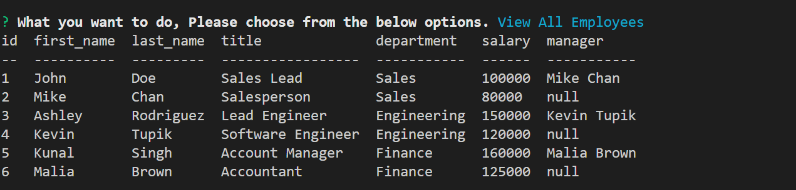

## Add employee

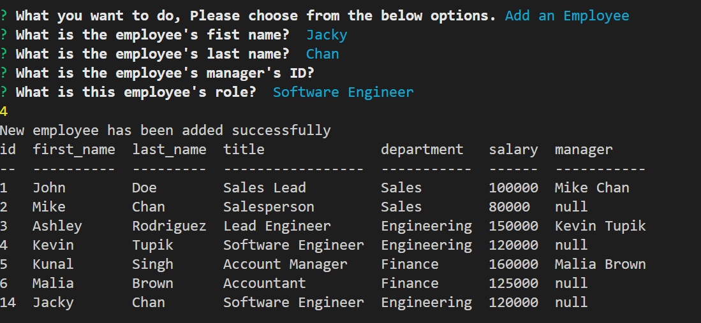

## Update an employee manager

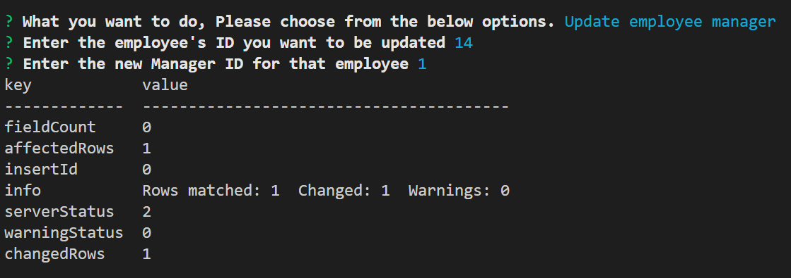

## Delete employee

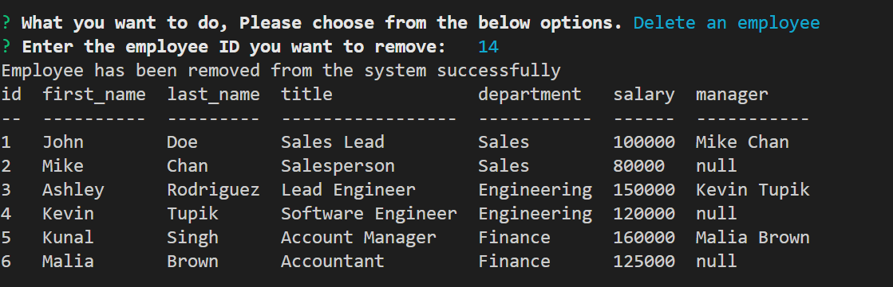

## View All Roles

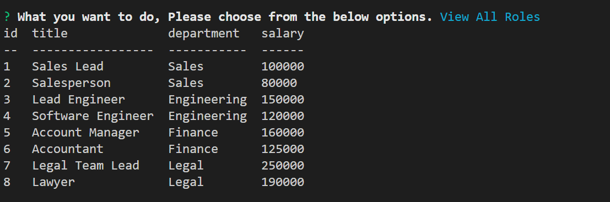

## Add Role

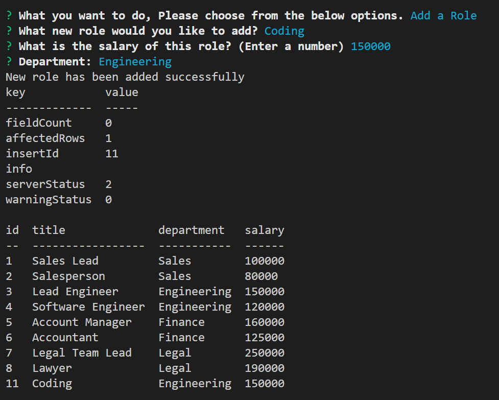

## Delete Role

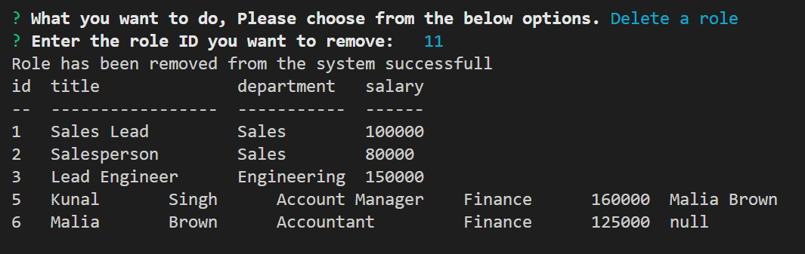

## View Departments

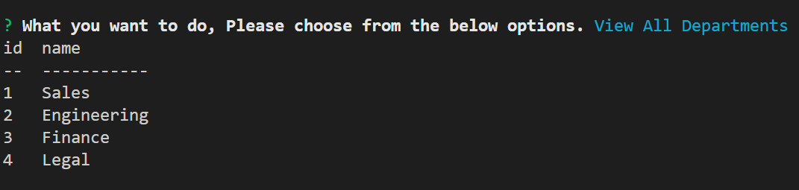

## View Department budget

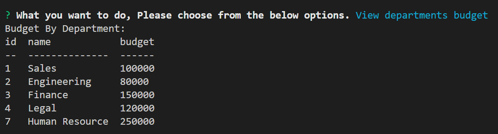

## View Employee by Department

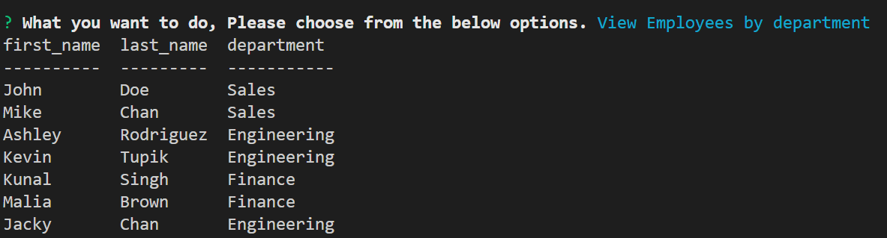

## View Employee by Manager

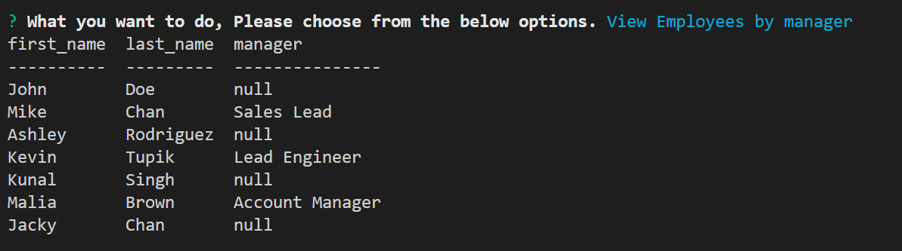

## Screen Recording

https://user-images.githubusercontent.com/114849473/210797351-ff542198-3e35-4d2e-a7be-68e86371cee9.mp4

